# Microsandbox Kubernetes Operator — Design Document

## Table of Contents

- [Summary](#summary)
- [Motivation](#motivation)
  - [Goals](#goals)
  - [Non-Goals](#non-goals)
- [Proposal](#proposal)
- [Design Details](#design-details)
  - [System Overview](#system-overview)
  - [Sandbox Creation](#sandbox-creation)
  - [Sandbox Termination](#sandbox-termination)
  - [Daemon Crash and Re-adoption](#daemon-crash-and-re-adoption)
  - [Component Map](#component-map)
  - [Component Design](#component-design)
    - [msb-controller](#msb-controller)
    - [msb-daemon](#msb-daemon)
    - [Device Plugin](#device-plugin)
  - [CRD Specification](#crd-specification)
    - [runPolicy](#runpolicy)
  - [Storage Model](#storage-model)
    - [What the guest filesystem looks like](#what-the-guest-filesystem-looks-like)
    - [Node-local files via hostPath](#node-local-files-via-hostpath)
    - [The two storage layers](#the-two-storage-layers)
    - [Image cache](#image-cache)
    - [Writable upper layer](#writable-upper-layer)
    - [Scheduling and node affinity](#scheduling-and-node-affinity)
  - [State Model](#state-model)
    - [State ownership](#state-ownership)
    - [Failure modes](#failure-modes)
    - [Sandbox lifecycle state machine](#sandbox-lifecycle-state-machine)
    - [Run policy](#run-policy)
  - [Network Stack](#network-stack)
    - [How microsandbox networking works in a pod](#how-microsandbox-networking-works-in-a-pod)
    - [Network knobs](#network-knobs)
  - [Security Model](#security-model)
    - [Pod security context](#pod-security-context)
    - [How secrets work](#how-secrets-work)
    - [Secret handling chain in Kubernetes](#secret-handling-chain-in-kubernetes)
    - [RBAC](#rbac)
  - [Sandbox Access and SDK Integration](#sandbox-access-and-sdk-integration)
    - [How the SDK reaches a running sandbox](#how-the-sdk-reaches-a-running-sandbox)
    - [Protocol wire format](#protocol-wire-format)
    - [Access options from outside the pod](#access-options-from-outside-the-pod)
    - [V1: WebSocket bridge sidecar](#v1-websocket-bridge-sidecar)
    - [Cloud gateway](#cloud-gateway)
    - [Guest console logs](#guest-console-logs)
  - [Deployment](#deployment)
    - [Helm chart contents](#helm-chart-contents)
    - [Node requirements](#node-requirements)
    - [Port publishing](#port-publishing)
- [Risks and Mitigations](#risks-and-mitigations)
- [Alternatives](#alternatives)
  - [exec-based vs socket API for msb management](#exec-based-vs-socket-api-for-msb-management)
  - [Sidecar vs daemon-level bridge](#sidecar-vs-daemon-level-bridge)
  - [Node-local storage vs PVC-backed storage](#node-local-storage-vs-pvc-backed-storage)
  - [Webhook admission vs CEL rules](#webhook-admission-vs-cel-rules)
- [Open Questions](#open-questions)
- [References](#references)

---

## Summary

This document describes the design for a Kubernetes operator that exposes microsandbox microVM sandboxes as a first-class Kubernetes resource: a `Sandbox` CRD. Workloads running in a cluster can schedule ephemeral sandboxes the same way they schedule Pods today, with full access to Kubernetes-native primitives: namespaces, RBAC, Secrets, ResourceQuotas, and Services.

---

## Motivation

Microsandbox runs sandboxes as lightweight microVMs using [libkrun](https://github.com/containers/libkrun) (KVM on Linux). Each sandbox is an `msb` process that boots a guest via libkrun/KVM, runs an in-process [smoltcp](https://github.com/smoltcp-rs/smoltcp) TCP/IP stack to intercept all guest network traffic, and enforces egress policy, secret substitution, and optional TLS interception. All of this runs in the host process, invisible to the guest.

Running `msb` inside Kubernetes pods is non-trivial: it requires KVM device access, specific Linux capabilities, and careful handling of secrets and node-local storage.

### Goals

- Schedule and manage microsandbox microVMs as `Sandbox` CRDs via a Kubernetes-native API
- Expose `/dev/kvm` availability to the scheduler via a device plugin so sandbox pods land only on KVM-capable nodes
- Inject Kubernetes `Secret` values into the sandbox at runtime without storing them in the CRD spec
- Preserve the full microsandbox network stack (smoltcp, TLS interception, secret substitution, egress policy) inside the pod, with no functionality regression
- Ship as a Helm chart with minimal dependencies (no service mesh, no ingress controller, no storage classes)

### Non-Goals

- **Live migration**: sandboxes are ephemeral; kill and reschedule
- **Persistent sandbox storage**: no StorageClass provisioning, no PVC-backed or shared network storage (NFS/Ceph), no data migration across nodes. V1 sandboxes are storage-free beyond the ephemeral upper layer; persistent storage is future work.
- **Device hotplug**: no live attach/detach of block or network devices after boot
- **Resize beyond the boot envelope**: `cpus`/`memory` resize live only up to the `maxCpus`/`maxMemory` reserved at boot; growing past that ceiling needs a restart
- **Sandbox-to-sandbox networking**: same isolation model as local `msb`
- **macOS nodes**: Kubernetes does not support macOS as a node OS

---

## Proposal

The operator has three components, each owning a distinct concern.

The **controller** watches CRDs cluster-wide, creates pods, and syncs status. It is stateless and restartable; all durable state lives in the Kubernetes API.

The **daemon** runs on every node. `msb` must exec on the same machine as `/dev/kvm`; the `msb-runtime` container boots it there, and the daemon — co-located on the node — tracks the PID and reports its exit. The daemon is the bridge between a node-local OS process and the Kubernetes API.

Secret values cannot be stored in the CRD spec or passed as env vars. The controller mounts each referenced Secret as a read-only volume; the kubelet reads it, so the pod needs no Secret RBAC, and the runtime resolves the values in-process before `msb` starts.

One sandbox = one pod: two containers, `msb-runtime` and the `msb-bridge` sidecar. `msb-runtime` launches `msb` in detached mode (`msb` and `libkrunfw` are baked into its image); the daemon watches the pod, reads the PID from SQLite, and surfaces termination state back to the controller via pod annotations. The controller is the sole writer of CRD status. Secrets never appear in the pod spec, env vars, or logs.

---

## Design Details

The operator is implemented in Rust using [`kube-rs`](https://github.com/kube-rs/kube) (`kube::runtime::Controller`). Device plugin gRPC bindings are generated with `tonic` + `prost` from the upstream [`device_plugin.proto`](https://github.com/kubernetes/kubelet/blob/master/pkg/apis/deviceplugin/v1beta1/api.proto).

### System Overview

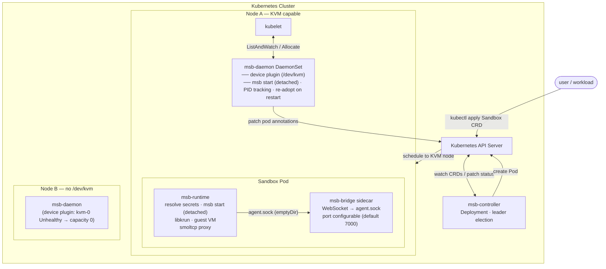

### Sandbox Creation

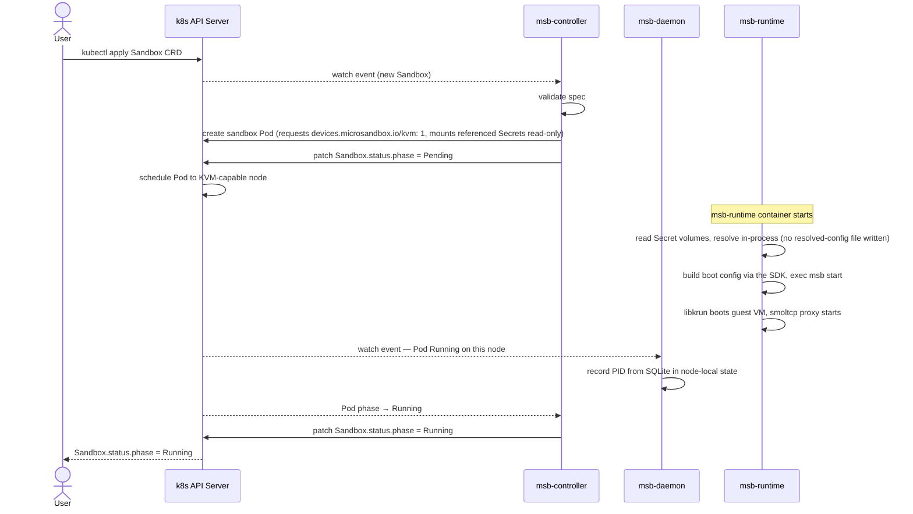

### Sandbox Termination

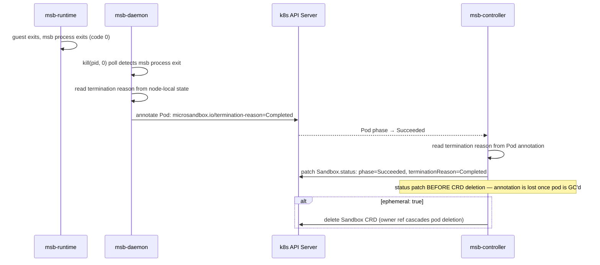

### Daemon Crash and Re-adoption

The `msb-runtime` container boots each sandbox in detached mode (`SpawnMode::Detached`, equivalent to `msb start`); the daemon only tracks it. This means:

- No parent watchdog pipe; the sandbox is not coupled to the daemon's lifetime
- The sandbox calls `setsid()` and becomes a new session leader
- A daemon crash leaves all sandboxes running as independent OS processes

On restart, the daemon re-adopts live sandboxes from the SQLite DB:

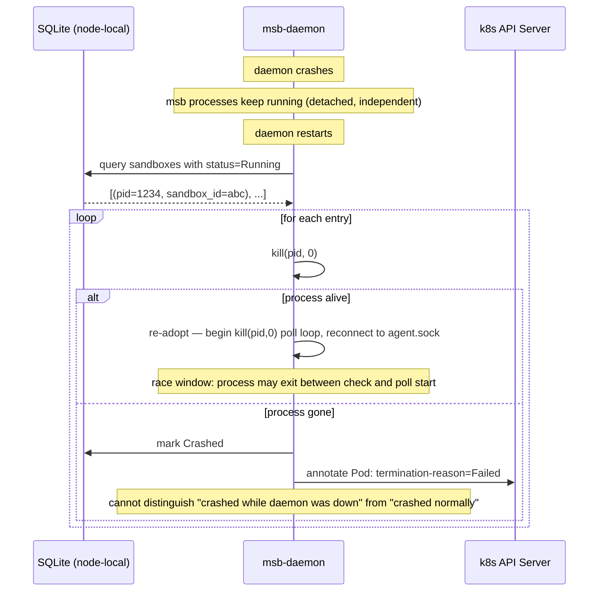

**Re-adoption mechanism.** The agent socket path is deterministic from the sandbox name (`sha256(name)[0:32].sock`), so the daemon can reconnect without any handshake. Liveness is tracked via `kill(pid, 0)` polling rather than `waitpid`; the SDK's `ProcessHandle` today wraps `tokio::process::Child` which requires spawn-time ownership. A `ProcessHandle::from_pid()` constructor that re-attaches proper `waitpid`-based exit detection is the missing piece; until that exists, the daemon polls.

**TOCTOU gap.** `kill(pid, 0)` and the first poll tick are not atomic. A sandbox that exits in that window appears live to the re-adoption sweep but dead on the first poll; the controller sees a brief period where it believes the sandbox is Running when it is not. With `pidfd_open`-based `ProcessHandle::from_pid()` this race disappears: the fd is acquired atomically at re-adoption time and delivers an event-driven exit notification.

**Termination reason on missed crash.** If a sandbox dies while the daemon is down, the daemon has no record of the exit code or cause. It marks the pod `Failed`, the same value used for any unclean msb exit. There is no way to distinguish "crashed while daemon was down" from "crashed normally and daemon wrote the annotation before it died." The `terminationReason` in these cases reflects the observed state, not the inferred cause.

**Graceful daemon restart.** On `SIGTERM`, the daemon does not need to do anything special; sandboxes keep running. It can drain in-flight annotation writes and exit cleanly. No watchdog disarm needed because detached mode never created a watchdog pipe.

### Component Map

| Component | Kind | Role |
|-----------|------|------|
| `msb-controller` | `Deployment` (leader election) | Watches `Sandbox` CRDs cluster-wide; creates/deletes sandbox pods; syncs CRD status |
| `msb-daemon` | `DaemonSet` | Per-node; watches sandbox pods; tracks PID via SQLite; re-adopts live sandboxes on restart; annotates pods with termination reason |
| `msb-runtime` | Container (per pod) | Boots `msb` in detached mode via the SDK; hosts the guest VM and smoltcp proxy |
| `msb-bridge` | Sidecar container (per pod) | WebSocket → `agent.sock` bridge; port configurable, default 7000; injected automatically by the controller; SDK clients connect here |
| `msb-console-log` | Container (per pod, opt-in) | Added when `logging.guestConsole` is set; tails guest stdout/stderr to its own stdout for `kubectl logs` |
| `msb-gateway` | `Deployment` (opt-in) | Speaks msb's cloud API so the unmodified SDK drives the cluster; lifecycle REST and exec WebSocket; off by default |
| Device plugin | Part of `msb-daemon` | gRPC server on kubelet socket; advertises `devices.microsandbox.io/kvm` |

### Component Design

#### msb-controller

Deployment with leader election enabled. Replica count is operator-configured (typically 2 for HA), with only one replica actively reconciling at a time via a Kubernetes `Lease`. Uses `kube-rs` (`kube::runtime::Controller`).

**Responsibilities:**
- Watch `Sandbox` CRDs via a `kube::runtime::Controller` reconciler
- On create: validate spec, create the sandbox Pod with `devices.microsandbox.io/kvm: 1` resource request; set the Sandbox CRD as an `ownerReference` on the Pod (pod is garbage collected automatically when the CRD is deleted)
- On Pod Running: patch `Sandbox.status.phase = Running`
- On Pod completion: read termination reason from Pod annotation, patch `Sandbox.status`. Then explicitly delete the pod (not via GC: the controller deletes it so stale pods don't accumulate). The controller must read the annotation **before** deleting the pod. If `runPolicy: RerunOnFailure` and the exit was unclean, requeue to create a new pod (cold boot). On terminal state (clean exit): if `ephemeral: true`, delete the CRD object (which cascades pod GC via owner reference).
- On delete: owner reference cascades pod deletion automatically; daemon detects pod deletion and kills the `msb` child
- On update: most spec fields are immutable after creation, enforced by per-field CEL `x-kubernetes-validations` rules in the CRD (`self == oldSelf` on each sealed field). The mutable exceptions are `desiredState` (start/stop) and `cpus`/`memory` (live resize, bounded by `maxCpus`/`maxMemory`); a change to a mutable field is reconciled, a change to a sealed one is rejected by the API server before it reaches the controller. Status updates are always allowed

**The controller is stateless.** All state is in the Kubernetes API. Everything it needs arrives via daemon-written pod annotations. A crash and restart is a no-op.

**Reconcile loop:**

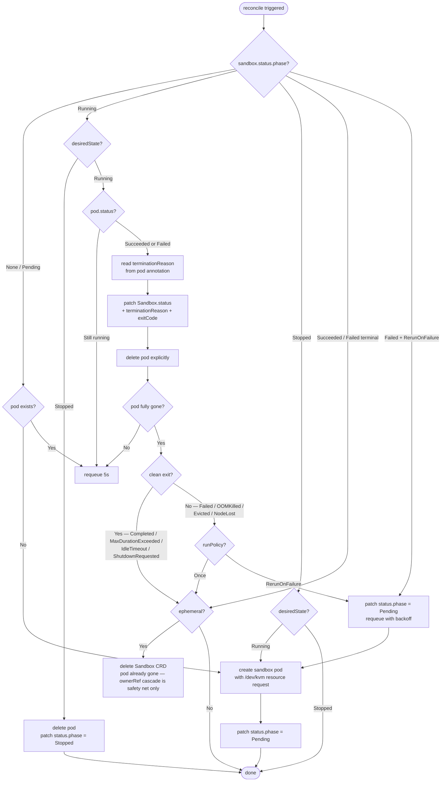

#### msb-daemon

DaemonSet on every node.

**Responsibilities:**
- Watch Pods on its own node that carry label `microsandbox.io/sandbox: "true"`
- When a sandbox Pod becomes Running: the `msb-runtime` container has booted `msb` in detached mode via the **msb Rust SDK** (config built in-process, off argv). Detached mode: no watchdog pipe, sandbox calls `setsid()`, survives daemon restarts as an independent OS process. Gap: `ProcessHandle::from_pid()` does not exist in the SDK today, so re-adoption uses `kill(pid, 0)` polling as an interim (see pidfd_open TODO below).
- On graceful shutdown: nothing to do. The msb processes are the runtime's, not the daemon's children, and run detached; they keep running while the daemon drains its annotation writes and exits.
- Track the child PID in SQLite; on exit, read termination reason, annotate the Pod
- On startup: query SQLite for sandboxes marked `Running`; probe each PID with `kill(pid, 0)`; re-adopt live ones by reconnecting to their agent socket; mark dead ones Crashed and annotate their pods
- Run the device plugin gRPC server on `/var/lib/kubelet/device-plugins/microsandbox-kvm.sock`
- Communicate with the controller **exclusively via CRD status and Pod annotations**; no direct RPC

Liveness check:

```rust
fn process_exists(pid: u32) -> bool {
    unsafe { libc::kill(pid as i32, 0) == 0 }
}
```

#### Device Plugin

gRPC server implementing the Kubernetes Device Plugin API (`v1beta1`, GA since k8s 1.26). Reference implementation: [Virtink's device plugin](https://github.com/smartxworks/virtink/blob/main/pkg/daemon/deviceplugin/deviceplugin.go).

Three non-obvious decisions:

**Fixed pool of 1000 device IDs.** The Device Plugin API accepts a list of named devices, not an integer count. A pool of 1000 IDs (`kvm-0` … `kvm-999`), all pointing to `/dev/kvm`, is the standard pattern ([Virtink](https://github.com/smartxworks/virtink/blob/main/pkg/daemon/deviceplugin/deviceplugin.go), [NVIDIA](https://github.com/NVIDIA/k8s-device-plugin)). The pool size is a scheduling ceiling; CPU and memory `requests` are the real gate. Configurable via Helm; 1000 is the default.

**Server before Register.** The plugin starts its gRPC server on its own socket first, then calls `Register` with kubelet. kubelet immediately dials back on `ListAndWatch`; if the server isn't up yet, that dial fails and the plugin appears dead.

**inotify on the plugin socket for kubelet restarts.** When kubelet restarts it deletes all plugin sockets. The plugin watches its own socket path; on removal it tears down, sleeps 5 seconds, and re-registers from scratch. Without this the plugin is permanently orphaned after any kubelet restart.

**Rust bindings.** No maintained crate exists. Vendor `v1beta1` from `github.com/kubernetes/kubelet/pkg/apis/deviceplugin/v1beta1/api.proto` and generate with `tonic-build`. `v1beta1` is the only version required by any production kubelet.

**Health → stream bridge.** `tokio::sync::watch`: the inotify watcher publishes health state; every open `ListAndWatch` stream clones the receiver and wakes on change.

**`Allocate` response.** Returns `DeviceSpec { host_path: "/dev/kvm", permissions: "rw" }`. No env vars or mounts.

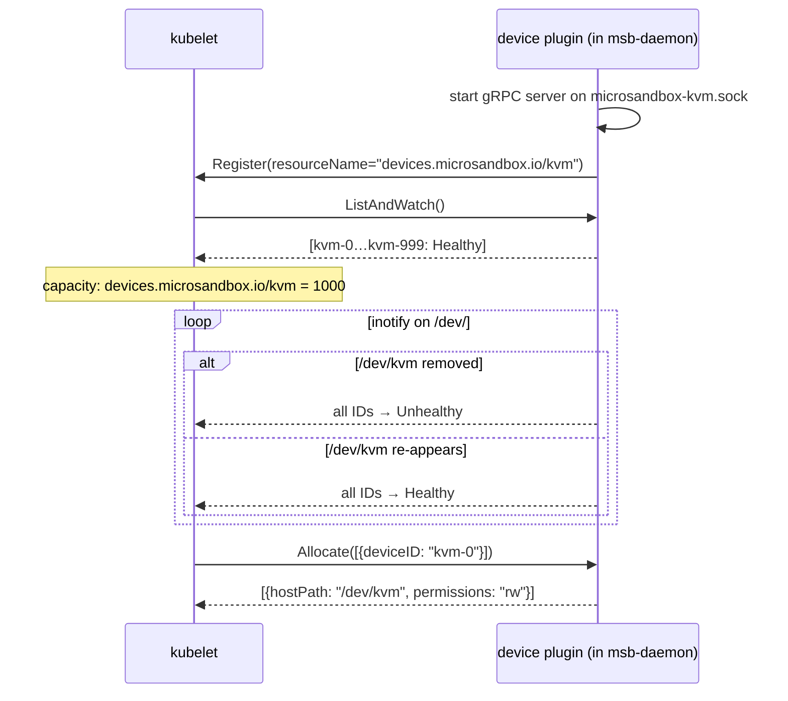

### CRD Specification

```yaml
apiVersion: sandbox.microsandbox.io/v1alpha1
kind: Sandbox
metadata:
  name: my-sandbox
  namespace: default
spec:
  # OCI image to use as the guest rootfs
  image: python:3.12

  # Running (default) or Stopped. Mutable — set Stopped to delete the pod while
  # keeping the Sandbox; set Running again to boot a fresh one.
  desiredState: Running

  # VM resources. cpus/memory are mutable — editing them resizes a running guest.
  cpus: 1
  memory: 512   # integer MiB

  # Boot-reserved resize ceiling (immutable; default = effective, i.e. no headroom).
  maxCpus: 2
  maxMemory: 1024

  # Command to run inside the guest (optional; defaults to image entrypoint)
  cmd: ["python", "script.py"]

  # Guest process shape (all optional)
  entrypoint: ["/bin/sh", "-c"]   # overrides the image entrypoint
  env:                            # plain, non-secret env vars (secrets use `secrets:`)
    - name: LOG_LEVEL
      value: debug
  workdir: /app
  shell: /bin/bash
  user: "1000"
  hostname: sandbox-1

  # Once (default) or RerunOnFailure
  runPolicy: Once

  # Whether to delete the CRD after the sandbox exits
  ephemeral: true

  # Secrets injected as env vars inside the guest
  # Values come from Kubernetes Secrets — never stored in the CRD
  secrets:
    - env: API_KEY
      valueFrom:
        secretKeyRef:
          name: my-k8s-secret
          key: api-key
      # Egress: only allow this env var's value to reach these hosts
      allowedHosts: ["api.openai.com"]

  # Network configuration
  network:
    # Whether to enable the smoltcp proxy (default: true)
    enabled: true

    # Egress/ingress policy.
    # preset selects a named msb NetworkPolicy preset (default: publicOnly)
    # publicOnly — allows DNS + Public egress, denies everything else
    # allowAll   — no restrictions
    # denyAll    — deny all egress and ingress
    policy:
      preset: publicOnly

    # TLS interception — msb MITM-proxies TLS, substitutes secrets, enforces policy
    # intercept defaults to false; enable when using secret substitution over HTTPS
    tls:
      intercept: true
      interceptedPorts:
        - port: 443

    # DNS overrides (optional — defaults use host /etc/resolv.conf → kube-dns in a pod)
    dns:
      rebindProtection: true       # block DNS rebinding attacks (default: true)
      nameservers: []              # override resolvers; empty = use host resolv.conf
      queryTimeoutMs: 5000

    # Published ports: expose guest port on the pod IP
    publishedPorts:
      - containerPort: 8080
        protocol: TCP              # TCP | UDP (default: TCP)

    # Maximum concurrent connections from guest (default: 256)
    maxConnections: 256

    # Ship host trusted CAs into guest (for corporate MITM proxies: Zscaler, Cloudflare Warp)
    trustHostCas: false

  # Storage — writable upper layer size (resource.Quantity)
  upper:
    size: 4Gi

  # Guest hardening, enforced in-guest by agentd (needs no host privilege)
  securityProfile: Restricted   # Default | Restricted (no_new_privs, drop CAP_SYS_ADMIN, nosuid/nodev mounts)
  rlimits:                       # POSIX rlimits applied at guest PID 1, inherited by all processes
    - resource: Nofile          # one of the 16 RLIMIT_* resources
      soft: 1024
      hard: 4096

  # Guest console logs (opt-in; adds a sidecar that streams guest stdout/stderr)
  logging:
    guestConsole: true

status:
  phase: Running             # Pending | Running | Stopped | Succeeded | Failed — written by controller
  podName: sandbox-my-sandbox-a1b2c  # written by controller at pod creation
  serviceName: msb-<hash>    # the per-sandbox ClusterIP Service; clients read it to reach the bridge
  nodeName: node-1           # where the pod was scheduled (a Node print column)
  startedAt: "2026-06-29T10:00:00Z"  # written by controller when phase transitions to Running
  terminatedAt: null         # written by controller when phase transitions to Succeeded/Failed
  # Source: daemon annotation (msb native)
  #   clean:   Completed | MaxDurationExceeded | IdleTimeout | ShutdownRequested
  #   unclean: Failed
  # Source: operator-inferred from Pod/Node state (not from msb)
  #   unclean: OOMKilled | Evicted | NodeLost
  terminationReason: null    # written by controller from pod annotation (daemon sets the annotation)
  exitCode: null             # written by controller from pod annotation
  restartCount: 0            # pod recreations under runPolicy: RerunOnFailure; drives the requeue backoff
  exposedPorts:              # ports reflected onto the Service, so kubectl describe shows guest listeners
    - name: port-8080
      port: 8080
      protocol: TCP
  appliedCpus: 1             # cpus/memory last applied to the guest; lag spec while a resize is pending
  appliedMemory: 512
  conditions:                # RestartRequired when a resize can't be applied live
    - type: RestartRequired
      status: "False"
      reason: Resized
```

#### desiredState

`desiredState: Stopped` deletes the pod but keeps the Sandbox object, and the controller records `phase: Stopped`. `Running` again boots a new pod. Since a sandbox runs on an emptyDir, this is a reboot, not a suspend/resume: the stopped sandbox holds no guest state, and start is a cold boot. The per-sandbox Service is retained across stop/start so the sandbox keeps a stable address. Stopping does not count as an exit — it never triggers `runPolicy`, `restartCount`, or the `ephemeral` delete.

#### runPolicy

msb has no native restart support. Every sandbox exits and the process terminates. `runPolicy` is entirely an operator construct: the controller is the restart loop.

| Value | Behavior |
|-------|----------|
| `Once` (default) | Run once. Clean or unclean exit: done. No retry. |
| `RerunOnFailure` | Run. Clean exit: done. Unclean exit: cold-boot a new pod. |

**Clean vs unclean** is determined by `terminationReason`. The value comes from two sources:

- **msb native** (daemon writes pod annotation): `Completed`, `MaxDurationExceeded`, `IdleTimeout`, `ShutdownRequested` (clean); `Failed` (unclean)
- **Operator-inferred** (controller reads Pod/Node state, msb never sees these): `OOMKilled` (kubelet OOM kill), `Evicted` (pod eviction), `NodeLost` (node NotReady timeout)

Clean: `Completed`, `MaxDurationExceeded`, `IdleTimeout`, `ShutdownRequested`
Unclean: `Failed`, `OOMKilled`, `Evicted`, `NodeLost`

Each retry is a full cold boot: a new pod, a new msb process, a fresh VM. The operator never restarts the same pod. Pod-level failure (eviction) and VM-process failure (non-zero exit) are treated the same. Both are unclean, both trigger a retry under `RerunOnFailure`.

`RerunOnFailure` retries indefinitely. There is no `maxRetries` or retry counter. This matches KubeVirt and Virtink: neither has a built-in retry bound. If you want the sandbox stopped, delete the CRD. The controller is the restart loop; the user is the circuit breaker.

Retry requeue uses an explicit `Action::requeue(duration)`. kube-rs automatic exponential backoff only applies to reconcile errors, not success-path requeues. The retry interval must be managed explicitly in the controller.

**Immutability:** the spec is immutable *per field*, not as a whole. Each sealed field carries its own `x-kubernetes-validations` CEL rule (`self == oldSelf`), injected at CRD-generation time from an allowlist of the fields that are *not* sealed. The mutable fields are `desiredState`, `cpus`, and `memory`; every other field is rejected by the API server on update, before the change reaches the controller. `cpus`/`memory` are additionally bounded by `self.cpus <= maxCpus` / `self.memory <= maxMemory` so a resize can never exceed the boot envelope. `status` is managed exclusively by the controller and daemon. Each sealed field's description ends with the literal "This field is immutable." so `kubectl explain` states it plainly.

**Controller-injected containers:** The controller automatically adds `msb-bridge` as a second container in every sandbox pod and creates a `ClusterIP` Service for it. Users do not declare the bridge in the `Sandbox` spec; it is always present.

**Secret handling:** Secret values are resolved by the runtime at pod startup, from Secrets the kubelet mounts read-only, and never appear in CRD fields, Pod env vars, or logs.

### Storage Model

#### What the guest filesystem looks like

The guest root filesystem is two virtio-blk devices merged by [overlayfs](https://docs.kernel.org/filesystems/overlayfs.html) at boot:

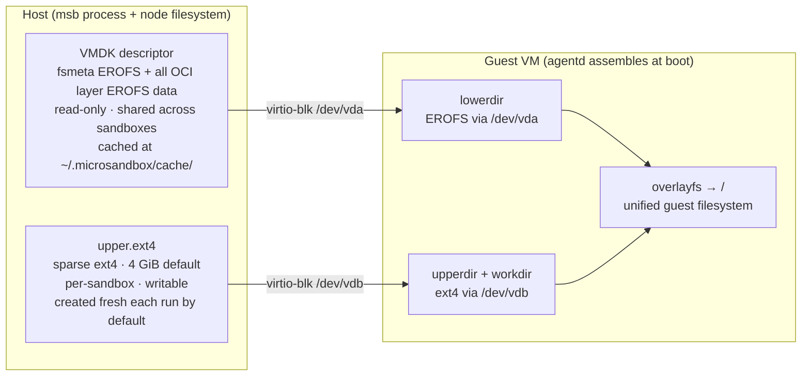

#### Node-local files via hostPath

`msb` needs access to files on the node's filesystem: the VMDK image cache and `upper.ext4`. The pod runs on that same node. The operator uses a `hostPath` volume pointing at `~/.microsandbox/` on the node, mounted into the `msb-runtime` container at the same path:

```yaml
volumes:
  - name: msb-state
    hostPath:
      path: /root/.microsandbox
      type: DirectoryOrCreate
containers:
  - name: msb-runtime
    volumeMounts:
      - name: msb-state
        mountPath: /root/.microsandbox
```

`hostPath` bypasses k8s storage accounting, intentional for a cache `msb` manages entirely. Downside: the scheduler is blind to disk consumption.

> [!NOTE]
> The image cache is read-only and shared across sandboxes on the same node; `hostPath` is permanently the right primitive for it. Stateful storage that would need to survive node loss (a persistent upper layer, or PVC-backed volumes) is future work; V1 has none.

#### The two storage layers

| Layer | What it is | Ephemeral? | Shared? | k8s aware? |
|-------|-----------|------------|---------|-----------|
| **Image cache** (EROFS/VMDK) | OCI layers converted to EROFS, cached on node | No, persists until evicted | Yes, all sandboxes on the same node sharing the same image | No, managed by msb-daemon |
| **Writable upper** (`upper.ext4`) | Sparse ext4 capturing all guest writes | Yes, deleted on exit | No, one per sandbox | No, node-local file in sandbox state dir |

#### Image cache

OCI layers are pulled once, converted to EROFS, and cached at `~/.microsandbox/cache/`. Subsequent sandboxes on the same node using the same image skip pull and conversion. Cache managed entirely by `msb`.

#### Writable upper layer

`upper.ext4` is created fresh each run and deleted on exit (task-runner behaviour). The size is configurable via `upper.size` (default `4Gi`). There is no retain-across-runs flag in current `msb`; every run starts from a clean upper layer.

#### Scheduling and node affinity

Sandbox pods carry no `nodeName` or affinity; the scheduler places them freely on any KVM-capable node. `status.nodeName` reports where a pod landed and surfaces as a `Node` print column. With persistent, node-local storage, scheduling would need to follow the data, via PV `nodeAffinity` and `WaitForFirstConsumer` binding.

### State Model

#### State ownership

The controller and daemon never share a private channel. The Kubernetes API is the only coordination point between them. Each owns a distinct slice of state:

| Data | Kubernetes API | Node-local | Notes |
|------|---------------|------------|-------|
| Sandbox spec (image, resources, policy) | Yes, source of truth | Yes, working copy read by the runtime | Kubernetes API wins on conflict |
| Sandbox phase / status | Yes | Yes | Daemon observes node; controller writes to Kubernetes API |
| Running PID | No | Yes | Only meaningful on the node; controller never reads it |
| Termination reason | Yes | Yes | Daemon observes exit, annotates Pod; controller copies to CRD status |
| OCI image layer cache | No | Yes | Node-local; Kubernetes API is the wrong place |
| Secret values | Never | On the kubelet's Secret mount | Read-only volume, like any pod's `secretKeyRef`; the runtime resolves it in-process |

#### Failure modes

| Failure | What dies | What survives | Operator response |
|---------|-----------|---------------|-------------------|
| `msb` process crashes | Guest VM, in-flight I/O | Node-local state, image cache on disk | Daemon detects child PID exit, annotates Pod Failed; controller patches CRD; if `ephemeral`, deletes CRD; if `runPolicy: RerunOnFailure`, creates new Pod |
| Pod OOMKilled by kubelet | Same | Same | k8s reports Pod Failed; controller handles identically |
| `msb-daemon` crashes mid-run | Nothing; `msb` processes keep running (detached, independent) | SQLite DB, running sandboxes | Daemon restarts, queries DB for `status=Running`, probes each PID, re-adopts live ones, marks any that died while daemon was down as Failed (terminationReason=Failed, indistinguishable from a normal unclean exit) |
| `msb-controller` crashes | Nothing; sandboxes keep running | Everything | Controller restarts, re-watches all CRDs, reconciles idempotently |
| Node graceful drain | Guest VM (after pod eviction) | CRD in Kubernetes API, image cache on other nodes | Pod evicted; controller marks CRD Failed or creates new Pod per `runPolicy` |
| Node hard crash | Guest VM, node-local state (lost) | CRD in Kubernetes API only | Pod stuck `Unknown`; controller marks CRD Failed after configurable timeout (default 5m) |
| Kubernetes API unavailable | Operator cannot reconcile | Sandboxes running on nodes (orphaned) | Operator cannot reconcile; manual recovery; sandboxes run until natural exit |

#### Daemon re-adoption on restart

Covered in [Daemon Crash and Re-adoption](#daemon-crash-and-re-adoption).

#### Sandbox lifecycle state machine

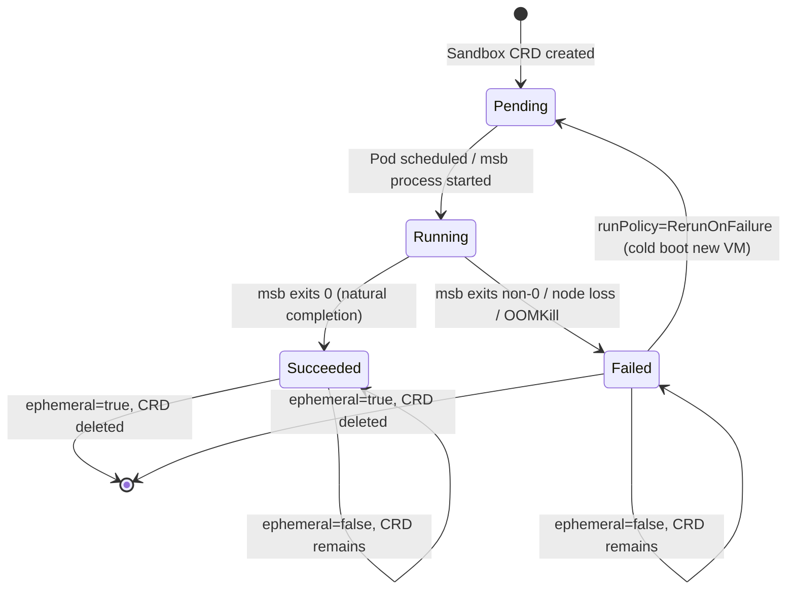

#### Run policy

All sandbox pods use `RestartPolicy: Never`. Kubernetes never restarts containers itself. The controller owns all restart decisions.

- **`Once`** (default): controller creates one pod; on exit (any code), patches CRD to Succeeded/Failed and stops. The pod is not recreated.
- **`RerunOnFailure`**: controller creates a new pod on any unclean exit: `msb` exits non-zero (`Failed`), kubelet OOM-kills the pod (`OOMKilled`), pod is evicted (`Evicted`), or the node is lost (`NodeLost`). Each retry is a cold boot (fresh VM, no memory of the previous run). No restart on clean exit.

`RerunOnFailure` retries indefinitely. Delete the CRD to stop a looping sandbox. `Always` and `Halted` are not exposed; they require a stopped/paused VM state that `msb` does not have.

### Network Stack

#### How microsandbox networking works in a pod

The guest VM sees a normal network interface (`172.16.0.2`), backed by a virtio-net queue that libkrun wires into the `msb` process. On the host side of that queue sits a smoltcp TCP/IP stack running entirely in userspace. There are no TAP or TUN devices; the kernel routing table is untouched; the CNI plugin sees one pod IP and nothing else.

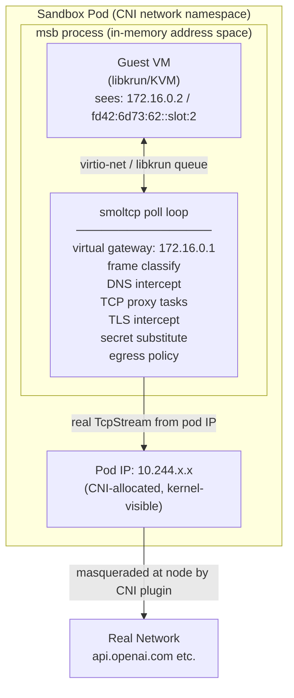

Outbound connections from the guest pass through the smoltcp poll loop, which classifies each SYN, applies egress policy, intercepts TLS and DNS where configured, and opens a real `TcpStream` from the pod IP to the destination. Inbound traffic has no path to `172.16.0.2` from outside the pod. The only way in is a declared `publishedPort`: `msb` binds a listener on the pod IP and proxies into the guest in userspace. The operator creates a `ClusterIP` Service per sandbox and sets `hostBind` to `0.0.0.0`.

In a pod (one sandbox per pod), the slot is always 0. The operator does no IPAM and needs no coordination with the CNI.

`NetworkPolicy` applies at the pod level, below msb's proxy. If pod-level egress is restricted, it must allow the same destinations as the msb-level policy, otherwise msb allows a connection that the kernel drops silently.

#### Network knobs

The `spec.network` fields the CRD exposes (all map directly to msb `NetworkConfig`):

| Field | Type | Default | Purpose |
|-------|------|---------|---------|
| `enabled` | bool | true | Disable smoltcp proxy entirely |
| `policy.preset` | string | `publicOnly` | Named egress/ingress policy preset |
| `tls.intercept` | bool | false | MITM-proxy TLS to enforce policy and substitute secrets |
| `tls.interceptedPorts[].port` | integer | (none) | Which ports get TLS interception (typically 443) |
| `dns.rebindProtection` | bool | true | Block DNS rebinding attacks |
| `dns.nameservers` | string[] | [] | Override DNS resolvers; empty = host `resolv.conf` |
| `dns.queryTimeoutMs` | integer | 5000 | DNS query timeout in milliseconds |
| `publishedPorts[].containerPort` | integer | (none) | Guest port to expose on the pod IP |
| `publishedPorts[].protocol` | string | `TCP` | `TCP` or `UDP` |
| `maxConnections` | integer | 256 | Max concurrent guest TCP connections |
| `trustHostCas` | bool | false | Copy host trusted CAs into guest for corporate MITM proxies |

`publishedPorts[].hostBind` is set by the operator to `0.0.0.0` automatically and is not user-configurable.

**Interface overrides (`interface.mac`, `interface.mtu`, `interface.ipv4Address`, `interface.ipv4Pool`) are not exposed.** All are derived from the sandbox slot; manual overrides risk IP conflicts between sandboxes on the same node with no valid use case in a cluster context.

**NetworkPolicy model.** The policy is a structured rule list. Each rule has:
- `direction`: `Egress`, `Ingress`, or `Any`
- `destination`: `Any`, `Cidr(prefix)`, `Domain(name)`, `DomainSuffix(name)`, or `Group(g)`
- `ports`: optional port ranges
- `action`: `Allow` or `Deny`

Built-in destination groups: `Public`, `Private`, `Loopback`, `LinkLocal`, `Metadata`, `Multicast`, `Host`.

Built-in presets:

| Preset | Behaviour |
|--------|-----------|
| `publicOnly` (default) | Allow DNS + Public egress; deny everything else |
| `allowAll` | No restrictions |
| `denyAll` | Deny all egress and ingress |
| `nonLocal` | Allow non-RFC-1918 egress; deny Private/Loopback |

**SNI + DNS double-check.** For allow rules matching a domain, msb checks both the TLS SNI and the DNS cache entry; the destination IP must match the DNS A/AAAA record returned for the domain. This prevents SNI spoofing. Deny rules match SNI alone.

**`trustHostCas`.** Required when nodes sit behind a corporate MITM proxy (Zscaler, Cloudflare Warp, Netskope); copies the host CA bundle into the guest so outbound TLS verifies correctly.

### Security Model

#### Pod security context

```yaml
spec:
  securityContext:
    runAsNonRoot: true
    runAsUser: 1000
  containers:
  - name: msb-runtime
    env:
    - name: MSB_HOME
      value: /msb-home        # /root/.microsandbox is inaccessible to non-root
    securityContext:
      allowPrivilegeEscalation: false
      capabilities:
        drop: ["ALL"]
        add: ["NET_ADMIN"]
    resources:
      limits:
        devices.microsandbox.io/kvm: 1
```

**`CAP_NET_ADMIN`** is required by libkrun internally for its virtio-net setup. Microsandbox's own network stack (smoltcp) is pure userspace: no TAP devices, no iptables. `NET_ADMIN` comes entirely from libkrun, not smoltcp. `SYS_ADMIN` is not required; the device plugin grant of `/dev/kvm` is sufficient for KVM ioctls. No `--privileged` flag. This is tighter than KubeVirt's virt-launcher (`NET_ADMIN + NET_RAW + SYS_NICE`); microsandbox needs `NET_ADMIN` only.

`NET_ADMIN` is in the `baseline` Pod Security Standard allowlist. Sandbox namespaces need `enforce: baseline`; no per-capability exemption required. Clusters enforcing `restricted` cluster-wide need a namespace-level override.

**Non-root requirements.** To open `/dev/kvm`, a non-root process would normally need to be in the node's `kvm` group, whose GID is node-dependent and not standardised. Rather than plumb that GID through the pod (`supplementalGroups`), the daemon relaxes `/dev/kvm` to world-rw at startup, so any uid can open it and the sandbox pod needs no `kvm` group membership.

Beyond that, the pod needs `MSB_HOME` pointing to a writable path; the default (`/root/.microsandbox`) is inaccessible to a non-root uid, and libkrun has no uid==0 check.

#### Guest-level hardening

The securityContext above hardens the pod. `spec.securityProfile` and `spec.rlimits` harden the guest, a layer inside the VM that agentd enforces on guest processes and that therefore needs no host privilege. `Restricted` sets `no_new_privs`, drops `CAP_SYS_ADMIN`, and forces `nosuid,nodev` on user mounts for exec sessions; `rlimits` are applied at guest PID 1 so every process inherits them.

#### How secrets work

Secrets in microsandbox are per-sandbox, declared as `SecretEntry` structs inside `NetworkConfig` → `SecretsConfig`. Each entry carries:

- `env_var`: the environment variable name the guest sees, set to the `placeholder` value
- `value`: the actual secret string (never enters the guest)
- `placeholder`: what the guest sees instead (e.g. `$MSB_API_KEY`)
- `allowed_hosts`: which hosts the proxy is permitted to substitute this value to
- `require_tls_identity`: only substitute after TLS SNI verification (default: true)

The `NetworkConfig` (including all `SecretEntry.value` fields) is part of `LaunchConfig`. The runtime builds it in-process and hands it to the SDK, so the values stay in memory and never reach argv or `/proc/<pid>/cmdline`. The proxy intercepts outbound HTTP/HTTPS, finds the placeholder in headers/body/auth, and substitutes the real value. All substitution happens inside the `msb` process, invisible to the guest.

#### Secret handling chain in Kubernetes

The runtime builds a `LaunchConfig` with real `SecretEntry.value` fields populated before `msb start` runs. The controller mounts each referenced Secret as a read-only volume; the kubelet performs the read, so no component holds Secret API access.

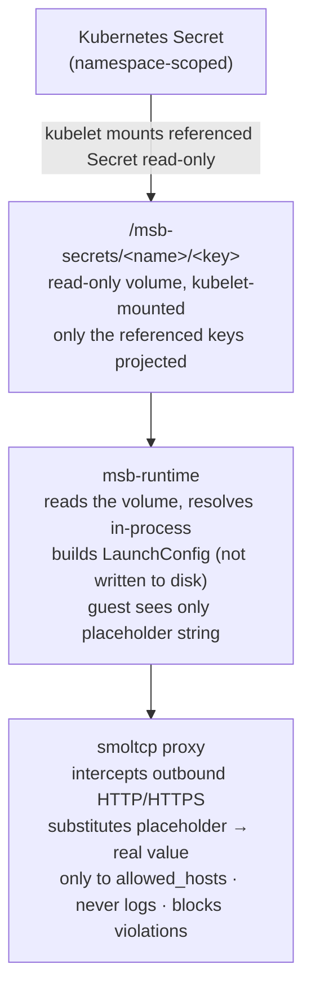

Secret values never appear in: CRD spec/status, Pod env vars, container argv, image layers, or log output.

#### RBAC

Two ServiceAccounts, each scoped to the minimum needed. No component has Secret API access: the kubelet mounts referenced Secrets, so the pod reads them off a volume under the default ServiceAccount.

**`msb-controller`** has a ClusterRole covering Sandbox CRDs, pods, services, events, and leases. It has no secrets access.

**`msb-daemon`** has a ClusterRole with `pods: patch` (to write termination annotations) and `nodes: get`. The node read is cluster-wide because RBAC cannot scope to a single node via fieldSelector; this is a known over-permission. The pod patch is similarly cluster-wide, which means a compromised daemon on one node could annotate pods it does not own. Both are V1 limitations acknowledged here; the Helm chart should document them.

Mounting the Secret exposes the pod to exactly the Secrets it references and nothing more — tighter than an API read, which RBAC can only grant across all Secrets in a namespace.

`Sandbox` is namespace-scoped, so standard Kubernetes isolation applies: RBAC, `ResourceQuota`, and `NetworkPolicy` all work identically to pods. Two aggregated ClusterRoles (`sandbox-operator`, `sandbox-viewer`) are shipped with the Helm chart for tenants to bind into their own namespaces via RoleBinding. Quotas use `count/sandboxes.sandbox.microsandbox.io`; all create/delete operations appear in the audit log with caller identity.

**ResourceQuota example:**

```yaml
apiVersion: v1
kind: ResourceQuota
metadata:
  name: sandbox-quota
  namespace: team-a
spec:
  hard:
    count/sandboxes.sandbox.microsandbox.io: "10"
    requests.cpu: "20"
    requests.memory: "40Gi"
```

### Sandbox Access and SDK Integration

#### How the SDK reaches a running sandbox

SDK-to-sandbox control plane: Unix domain socket over virtio-serial.

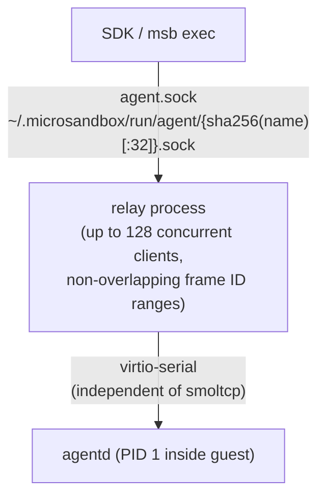

The relay accepts up to 128 concurrent SDK clients, each assigned a non-overlapping frame ID range. `--no-net` has no effect on this path. A fully network-isolated sandbox is still fully usable for exec and file operations.

#### Protocol wire format

The agent protocol wire format is:

`[len: u32 BE][id: u32 BE][flags: u8][CBOR(version, type, payload)]`

The `id` (correlation ID) and `flags` fields sit **outside** the [CBOR](https://www.rfc-editor.org/rfc/rfc8949) payload. The full frame prefix is 9 bytes: `len` (4) + `id` (4) + `flags` (1). Relay intermediaries read those 9 bytes, make routing decisions, and forward frames without deserializing the CBOR payload.

`AgentClient` exposes raw protocol access via `stream_raw` and `send_raw`; these send raw CBOR frames without SDK parsing. `AgentClient::connect_stream` accepts any `AsyncRead + AsyncWrite`, so wrapping a WebSocket connection into that interface is the only glue code needed.

#### Access options from outside the pod

| Path | Transport | External access | Full SDK API |
|---|---|---|---|
| `agent.sock` direct | UDS (local only) | no | yes, full SDK surface |
| WebSocket bridge (V1) | TCP/WebSocket | yes | yes, via `AgentClient::connect_stream` |
| Cloud gateway | HTTP + WebSocket | yes | yes, the unmodified SDK via `MSB_API_URL` |
| `msb ssh serve` | TCP/SSH | yes | no, interactive shell only |

`msb ssh serve` binds a real TCP listener (default port 2222). Exposed via a Kubernetes Service it gives interactive shell access from outside the pod without any gateway.

#### V1: WebSocket bridge sidecar

`agent.sock` is a Unix domain socket, reachable within the pod but not from outside. The bridge makes it network-accessible: it runs as a sidecar in the sandbox pod, accepts WebSocket connections on TCP port 7000, and forwards frames verbatim to `agent.sock`. No CBOR parsing; it moves bytes. The controller creates a `ClusterIP` Service per sandbox so SDK clients elsewhere in the cluster can reach it.

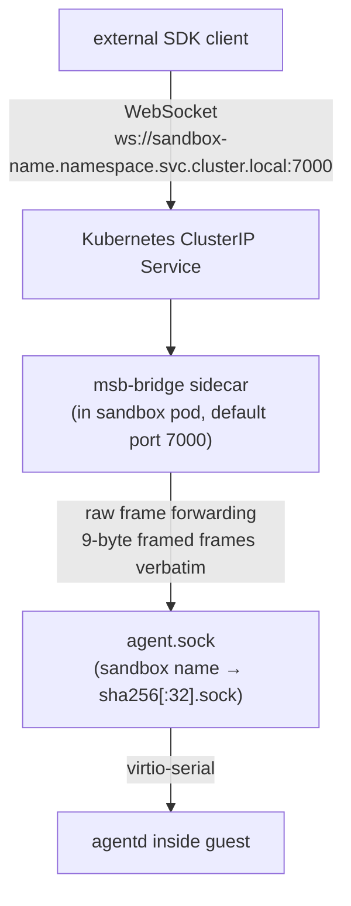

On each incoming WebSocket connection the bridge dials `agent.sock`, reads the 8-byte handshake prologue (`id_min u32 BE + id_max u32 BE`) and the `core.ready` frame, sends them together as the first WebSocket message, then enters bidirectional byte forwarding. If the dial fails (sandbox restarting), it retries with backoff; the socket path is deterministic from the sandbox name so no re-discovery is needed.

The bridge also exposes `POST /control` on its health port: it relays one JSON request to the sandbox's control socket (`<sandbox>.control.sock`) and returns the reply. The controller uses it to apply a live cpu/memory resize, reaching the socket through the per-sandbox Service instead of exec'ing into the pod.

#### Cloud gateway

The bridge reaches one sandbox's exec socket. The **gateway** (`msb-gateway`) is the cluster-level entrypoint: it speaks msb's cloud API, so the unmodified msb SDK and CLI drive the cluster by pointing `MSB_API_URL` at it, with `MSB_API_KEY` set to a Kubernetes ServiceAccount token. No client changes.

It is one binary with two halves:

- **Lifecycle** — a REST surface (create, get, list, delete, start, stop) that maps the cloud API to the `Sandbox` CRD. `create` writes a Sandbox and waits until Running; `start`/`stop` patch `spec.desiredState`; `list` filters by label. SDK labels become `metadata.labels` (so they are selectable), or annotations when they don't fit a k8s label.
- **Exec** — a WebSocket endpoint that forwards the client to the target sandbox's bridge, reusing the bridge's byte-for-byte splice.

Each request carries a bearer token: a TokenReview validates it, then a SubjectAccessReview checks the caller may perform the verb on `sandboxes` in their namespace. The gateway is opt-in (`gateway.enabled`, default off) and exposes a ClusterIP Service only.

#### Guest console logs

`spec.logging.guestConsole` (opt-in, default off) adds an `msb-console-log` container to the pod. It reuses the runtime image, tails the guest's captured stdout/stderr, and prints one JSON line per entry to its own stdout — so `kubectl logs -c msb-console-log` shows the guest console. It is a plain container, not a native sidecar: it has no readiness contract and does not gate the runtime's start, so enabling it costs nothing at boot.

For SDK clients, the gateway exposes `GET /v1/sandboxes/<name>/logs`, which streams that container's log in msb's cloud SSE format (`event: log` / `event: end`). This is live-follow only.


### Deployment

#### Helm chart contents

| Resource | Kind | Notes |
|----------|------|-------|
| `msb-controller` | `Deployment` | 2 replicas; leader election; cluster-wide |
| `msb-daemon` | `DaemonSet` | Every node; includes device plugin |
| `msb-gateway` | `Deployment` + `ClusterIP` `Service` | Opt-in (`gateway.enabled`, default off); SDK-compatible cloud endpoint |
| `sandboxes.sandbox.microsandbox.io` | `CustomResourceDefinition` | v1alpha1 |
| `msb-controller` | `ClusterRole` + `ClusterRoleBinding` | |
| `msb-daemon` | `ClusterRole` + `ClusterRoleBinding` | |
| `msb-controller` | `ServiceAccount` | |
| `msb-daemon` | `ServiceAccount` | |

No ingress, no service mesh, no storage classes, no cert-manager dependency.

#### Node requirements

- Nodes must have `/dev/kvm` accessible (character device, mode 0660)
- KVM is available on: bare metal, Hetzner bare metal, AWS `*.metal` instances, bare-metal GKE node pools, self-hosted clusters with nested virt enabled
- KVM is NOT available on: standard EKS/GKE/AKS VM nodes (no nested virt by default), Fargate, most managed node groups
- The device plugin reports `devices.microsandbox.io/kvm: 0` on non-KVM nodes; the scheduler will not place sandbox pods there

#### Port publishing

The operator sets `hostBind: 0.0.0.0` automatically for any `publishedPorts` entry and creates a `ClusterIP` Service. The sandbox is reachable within the cluster at `{service-name}.{namespace}.svc.cluster.local:{port}`. External access (LoadBalancer, Ingress) is the user's responsibility; out of scope for V1.

---

## Risks and Mitigations

**1. hostPath**

The `msb-runtime` container mounts a `hostPath` for the node-local image cache and upper layer. In V1 nothing on it needs to survive a reschedule (the upper layer is ephemeral, the cache is rebuildable), so node loss costs no sandbox data. `hostPath` becomes a real constraint only once persistent storage lands.

_Mitigation:_ none needed in V1 — a rescheduled pod cold-boots cleanly, losing nothing. The node-loss timeout still marks a Sandbox Failed after a configurable period. This becomes a real trade-off to design for when persistent storage lands.

**2. No KVM emulation fallback**

libkrun has no TCG/software emulation mode. If `/dev/kvm` is absent, `msb` fails immediately with no graceful degradation.

_Mitigation:_ Enforce via device plugin resource request; pods cannot be scheduled to nodes without KVM. Document this as a hard cluster requirement at installation time.

**3. `NET_ADMIN` and Pod Security Standards**

`NET_ADMIN` is permitted by the `baseline` PSS profile but blocked by `restricted`. Clusters enforcing cluster-wide `restricted` cannot run sandbox pods without a namespace-level override.

_Mitigation:_ Operator creates sandbox namespaces with `enforce: baseline`. No per-capability exemption needed; `SYS_ADMIN` is not required. Clusters enforcing `restricted` cluster-wide need a namespace-level `enforce: baseline` override for sandbox namespaces.

**4. Secret leakage surface**

Secrets transit through: the kubelet-mounted read-only volume, and the runtime/msb process memory. Each is a potential leak surface.

_Mitigation:_ the volume holds only the referenced Secret keys and is never written by us. The runtime keeps resolved values in memory only, off argv and `/proc/<pid>/cmdline`. The guest never sees real values. The proxy never logs substituted values. No secret appears in CRD spec, Pod env vars, or container argv.

---

## Alternatives

### exec-based vs socket API for msb management

**Decision: exec-based (current).**

The `msb-runtime` container uses the msb Rust SDK to boot `msb` in detached mode; the daemon tracks the PID via SQLite and reads SQLite for status. No changes to `msb` internals required.

**Rejected: Unix socket management API.** Adding a socket API to `msb` (analogous to [Cloud Hypervisor](https://github.com/cloud-hypervisor/cloud-hypervisor)'s socket that Virtink uses) would allow the daemon to call `VmInfo()`-equivalent RPCs instead of scraping SQLite. More robust and richer lifecycle events, but requires invasive changes to `msb`. Deferred until exec-based limitations become concrete.

### Sidecar vs daemon-level bridge

**Decision: sidecar.**

The WebSocket bridge runs as a second container in the sandbox pod. One bridge per sandbox; a crash affects only that sandbox. No routing logic needed; the sidecar always talks to exactly one `agent.sock`.

**Rejected: daemon-level bridge.** Fewer processes, but the daemon must route incoming connections to the right `agent.sock`, and a crash affects every sandbox on the node simultaneously.

### Node-local storage vs PVC-backed storage

**Decision: raw node-local for V1.**

Both storage layers are node-local sparse files managed by `msb` on the host filesystem; no StorageClass, no PVC required. Neither poses a storage problem in V1: the image cache (EROFS) is read-only and inherently node-local, and the upper layer is thrown away on exit. Persistent, node-survivable storage is future work; the PVC-backed direction is discussed in [Open Questions](#open-questions).

### Webhook admission vs CEL rules

**Decision: no webhook for V1.**

Field validation beyond what OpenAPI schema expresses is handled by [`x-kubernetes-validations` CEL rules](https://kubernetes.io/docs/tasks/extend-kubernetes/custom-resources/custom-resource-definitions/#validation-rules) in the CRD itself. Spec defaulting is handled by `default:` fields in the CRD OpenAPI schema. Cross-resource checks (e.g. "does this Secret exist?") fall out of the Secret mount; if a referenced Secret is missing, the kubelet cannot mount it and the pod fails to start, same behaviour as any pod with a bad `secretKeyRef`. Image policy is better delegated to an existing policy engine (OPA/Gatekeeper, Kyverno).

**Rejected: validating/mutating admission webhook.** The operational cost (TLS cert management, availability requirement: a broken webhook blocks all Sandbox creates cluster-wide) is not justified when CRD schema validation and external policy engines cover the same ground. Add a webhook only when a concrete gap is found post-MVP.

---

## Open Questions

**1. Stateful storage: PVC-backed volumes**

V1 sandboxes are stateless: the upper layer is a raw host file thrown away on exit, and nothing survives a restart or a reschedule. Persistent, node-survivable storage is the V2 direction, backed by PVCs. PVCs with `WaitForFirstConsumer` let the scheduler pick the node first; the provisioner creates the volume there. PVCs would be deterministically named (`upper-{sandbox}`, `vol-{sandbox}-{name}`), created before the pod, and reattached on restart. `msb` sees them as block devices, identical to current sparse files from its perspective. `ReadWriteOncePod` (RWOP, GA in 1.29) is the right access mode; `ReadWriteOnce` allows multiple pods on the same node to mount the same PVC simultaneously.

Data movement between PVCs uses [CDI](https://github.com/kubevirt/containerized-data-importer). CDI selects the best available clone strategy: CSI native clone (no network I/O, requires same StorageClass), VolumeSnapshot clone (requires a VolumeSnapshotClass), or host-assisted clone (bytes stream over the network, works across any two StorageClasses). CDI never sets node affinity on cloned PVCs; topology is the CSI driver's concern. This requires a clean `msb` API for booting from a pre-existing block device path.

**2. Termination state relay: Pod annotation vs daemon status patch**

The daemon writes `terminationReason` to a Pod annotation; the controller reads it and copies it into `Sandbox.status`. This keeps the controller as the sole writer of CRD status, but creates a race for `ephemeral: true` sandboxes: ownerRef cascade GCs the pod immediately on CRD deletion, and the controller may not read the annotation in time. The alternative is for the daemon to patch `Sandbox.status.terminationReason` directly, which eliminates the race but introduces two writers on the status subresource. A partitioned status object (`status.node` owned by daemon, `status.phase` owned by controller) is the natural resolution but the right shape is unresolved.

**3. msb-bridge: universal sidecar vs opt-in**

The controller injects `msb-bridge` into every sandbox pod unconditionally. For ephemeral task-runner sandboxes (`runPolicy: Once`, no `publishedPorts`), the bridge is unreachable before the sandbox exits; it adds a container, an image pull, and a Service with no benefit. The counterargument is operational simplicity: no conditional controller logic, no user-facing knob to set wrong, and the SDK always works against any sandbox. The unresolved question is whether a `spec.access.bridge: false` field is worth the controller complexity, or whether making the bridge image small enough renders the cost negligible.

**4. Management socket and lifecycle operations**

The daemon currently observes `msb` by scraping SQLite and polling the PID. A management socket on `msb`, analogous to Cloud Hypervisor's `/run/cloud-hypervisor.sock` used by Virtink, would replace polling with typed RPCs and unlock operations that are not cleanly expressible today:

| Operation | Current state | With management socket |
|-----------|--------------|------------------------|
| Graceful shutdown | SIGTERM to msb process; may not reach guest | ACPI power button signal; guest OS shuts down cleanly |
| Pause / Resume | Not possible | Freeze VM execution in place; libkrun support untested |
| Reboot | Not possible | VM-level reboot without pod restart |

The `agentd` relay socket already exists for exec/file operations; the question is whether lifecycle operations warrant a second socket. The trigger to add it is a concrete requirement (graceful shutdown for databases, pause for snapshotting) that cannot be built cleanly on top of signal+polling.

**5. Snapshot CRDs**

`msb` has a complete offline snapshot system (CLI, Rust and Python SDKs, manifest with integrity verification). The primitives exist; the question is the Kubernetes API shape. The idiomatic pattern, following VolumeSnapshot and KubeVirt VirtualMachineSnapshot, is three CRDs: `SandboxSnapshot` (namespace-scoped, user-created), `SandboxSnapshotContent` (controller-managed, holds the artifact reference), and `SandboxSnapshotClass` (cluster-scoped, admin-facing). Boot-from-snapshot on `SandboxSpec` uses a typed `bootSource.snapshotRef` rather than an untyped string. The snapshot content backend maps naturally onto a PVC once persistent storage moves off `hostPath`.

---

## References

| Resource | Link |
|----------|------|
| Virtink project | [github.com/smartxworks/virtink](https://github.com/smartxworks/virtink) |
| KubeVirt project | [github.com/kubevirt/kubevirt](https://github.com/kubevirt/kubevirt) |
| Cloud Hypervisor | [github.com/cloud-hypervisor/cloud-hypervisor](https://github.com/cloud-hypervisor/cloud-hypervisor) |
| kube-rs | [github.com/kube-rs/kube](https://github.com/kube-rs/kube) |
| Kubernetes Device Plugin API | [kubernetes.io/docs/…/device-plugins](https://kubernetes.io/docs/concepts/extend-kubernetes/compute-storage-net/device-plugins/) |
| Kubernetes Device Plugin proto | [github.com/kubernetes/kubelet/…/device_plugin.proto](https://github.com/kubernetes/kubelet/blob/master/pkg/apis/deviceplugin/v1beta1/api.proto) |
| smoltcp (in-process TCP/IP stack) | [github.com/smoltcp-rs/smoltcp](https://github.com/smoltcp-rs/smoltcp) |
| libkrun | [github.com/containers/libkrun](https://github.com/containers/libkrun) |
| EROFS filesystem | [docs.kernel.org/filesystems/erofs](https://docs.kernel.org/filesystems/erofs.html) |
| overlayfs | [docs.kernel.org/filesystems/overlayfs](https://docs.kernel.org/filesystems/overlayfs.html) |
| CBOR (RFC 8949) | [rfc-editor.org/rfc/rfc8949](https://www.rfc-editor.org/rfc/rfc8949) |
| Kubernetes CRD versioning | [kubernetes.io/docs/…/custom-resources](https://kubernetes.io/docs/concepts/extend-kubernetes/api-extension/custom-resources/) |
| CRD validation with CEL | [kubernetes.io/docs/…/cel](https://kubernetes.io/docs/tasks/extend-kubernetes/custom-resources/custom-resource-definitions/#validation-rules) |
| Kubernetes VolumeSnapshot API | [kubernetes.io/docs/…/volume-snapshots](https://kubernetes.io/docs/concepts/storage/volume-snapshots/) |
| KubeVirt Snapshot Restore API | [kubevirt.io/user-guide/…/snapshot_restore_api](https://kubevirt.io/user-guide/storage/snapshot_restore_api/) |
| Local Persistent Volumes (KEP-121) | [kubernetes.io/blog/…/local-persistent-volumes-ga](https://kubernetes.io/blog/2019/04/04/kubernetes-1.14-local-persistent-volumes-ga/) |
| local-path-provisioner | [github.com/rancher/local-path-provisioner](https://github.com/rancher/local-path-provisioner) |
| KubeVirt run strategies | [kubevirt.io/user-guide/…/run_strategies](https://kubevirt.io/user-guide/compute/run_strategies/) |
