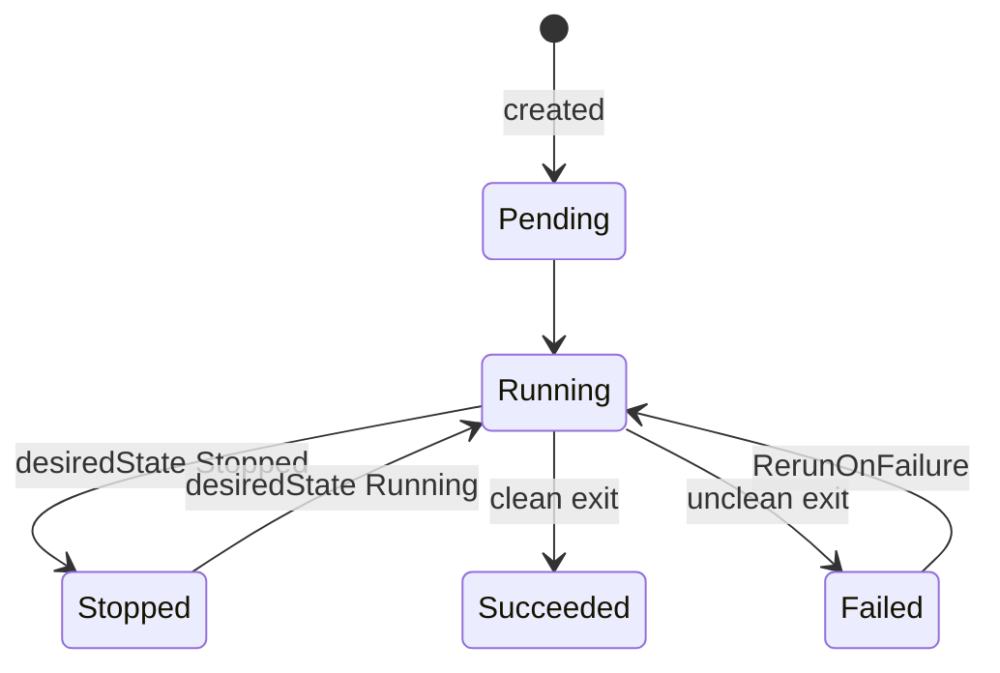

Set `spec.desiredState` to start or stop a sandbox, and `runPolicy` to control what
happens when it exits.

## Phases



| Phase | Meaning |
|---|---|
| `Pending` | scheduled, booting |
| `Running` | up and reachable |
| `Stopped` | stopped on request; restartable |
| `Succeeded` | the command exited cleanly |
| `Failed` | the command exited with an error |

## Stop and start

`spec.desiredState` is the power switch. Stopping removes the Pod but keeps the
`Sandbox`:

<CodeGroup>
```bash kubectl
kubectl patch sandbox agent-run-42 --type merge -p '{"spec":{"desiredState":"Stopped"}}'
kubectl patch sandbox agent-run-42 --type merge -p '{"spec":{"desiredState":"Running"}}'
```

```python SDK
sb = await (await Sandbox.get("agent-run-42")).connect()
await sb.stop()
await sb.start()
```
</CodeGroup>

<Warning>
  A stopped sandbox keeps no guest state. Starting it again is a fresh boot, not a
  resume; anything written inside the previous run is gone.
</Warning>

## Run to completion

Give a sandbox a command that exits and it becomes a task runner. When the command
finishes, the sandbox settles into `Succeeded` or `Failed`:

```yaml
apiVersion: sandbox.microsandbox.dev/v1alpha1
kind: Sandbox
metadata:
  name: build
spec:
  image: alpine:3.20
  cpus: 1
  memory: 512
  cmd: ["sh", "-c", "make && echo done"]
  runPolicy: Once
```

`runPolicy` decides what happens on an unclean exit:

| `runPolicy` | On clean exit | On unclean exit |
|---|---|---|
| `Once` (default) | stays `Succeeded` | stays `Failed` |
| `RerunOnFailure` | stays `Succeeded` | boots a fresh Pod and retries |

`RerunOnFailure` retries with an increasing backoff and has no retry limit; delete
the `Sandbox` to stop it. The `RESTARTS` column counts these retries.

## Delete a sandbox

Delete the `Sandbox` and its Pod goes with it:

```bash
kubectl delete sandbox agent-sandbox
```

A finished sandbox (`Succeeded` or `Failed`) is not deleted for you; the object
stays so you can read its result. Delete it when you are done with it.

<Note>
  Deleting the `Sandbox` deletes the sandbox instance, not the `Sandbox` resource
  type. Your other sandboxes are unaffected.
</Note>

## Expire automatically

A finished `Sandbox` is kept so its exit code and reason stay readable; it never
deletes itself on completion. To clean up on a schedule instead, set an absolute
expiry deadline:

```yaml
spec:
  lifecycle:
    shutdownTime: "2026-08-04T18:00:00Z"   # absolute, RFC3339
```

At that time the pod is deleted and, by default, the `Sandbox` is kept: its
`phase` settles `Succeeded` with `terminationReason: Expired`, so the record stays
readable. To delete the object too:

```yaml
spec:
  lifecycle:
    shutdownTime: "2026-08-04T18:00:00Z"
    shutdownPolicy: Delete
```

`shutdownTime` and `shutdownPolicy` are mutable: extend, shorten, or clear the
deadline at any time.

<Note>
  This is a wall-clock deadline enforced by the controller, independent of the
  guest's own `maxDurationSecs`/`idleTimeoutSecs` runtime bounds below.
</Note>

## Time limits

Cap how long a sandbox may run:

```yaml
spec:
  maxDurationSecs: 3600   # hard cap on total lifetime
```

<Note>
  `maxDurationSecs` stops the sandbox at the deadline, but the stop reads as a
  clean finish: `phase: Succeeded`, `terminationReason: Completed`, `exitCode: 0`.
  It does not surface a distinct `MaxDurationExceeded` reason.

  `idleTimeoutSecs` exists in the spec but has no effect on a run-to-completion
  sandbox: "idle" is measured from interactive agent activity (exec/fs sessions),
  which a `cmd`-driven workload never generates. Use `maxDurationSecs` or the
  wall-clock [expiry](#expire-automatically) to bound a sandbox instead.
</Note>
